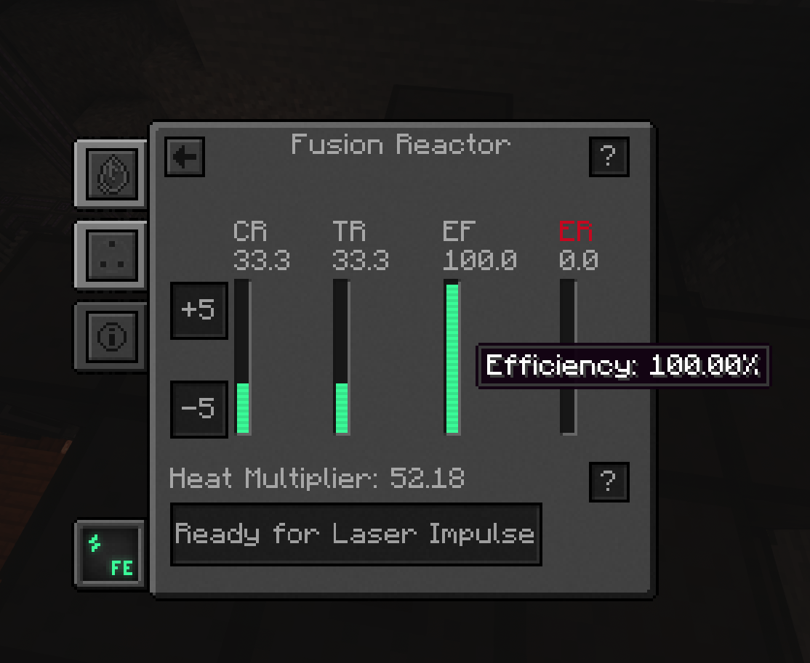
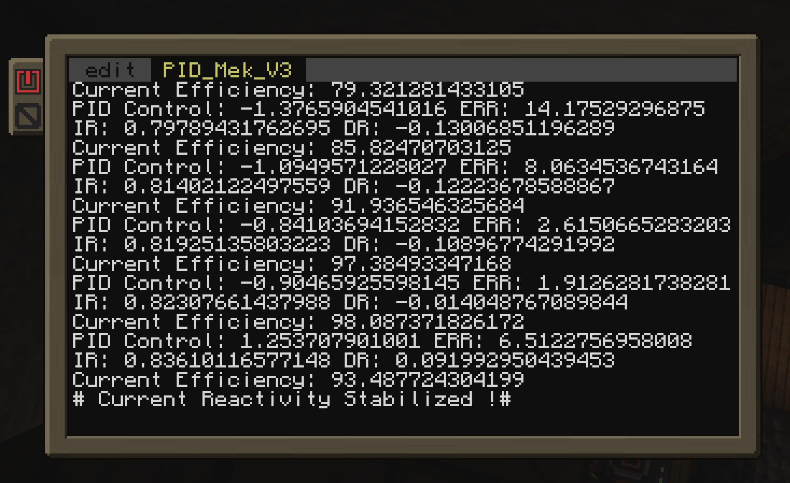

# Kinix

A Simple PID Controller for Mekanism Better Fission Reactor

---



## Requirements

- CC:Tweaked (or similar lua environment for minecraft)
- Better Fission Reactor For Mekanism

---

## Usage

- Copy the `kinix.lua` file to your minecraft computer using the `wget` command

```shell
wget https://raw.githubusercontent.com/TxMat/kinix/main/kinix.lua kinix.lua
```

- Run the program

```shell
./kinix.lua
```



---
## Configuration

kinix is configured to avoid overshoots and prefers to be slow and steady. You can change the comportment of the pid by adjusting the following variables:

- `kp` : Proportional gain
- `ki` : Integral gain
- `kd` : Derivative gain
- `deadband` : Deadband for the error

---
## Simulation

You can simulate the pid controller using the `simulator.lua` file. This file will simulate the reactor and the pid controller for testing pruposes.

However, the simulation is not perfect and greatly simplify the reactor by assuming instant response time.

It should only be used for debugging, not fine-tuning

---
## Disclaimer

This program while being highly efficient, does not prevent meltdowns. In the worst case scenario, (when the target reactivity changes from 90+ to 10- multiple times in a row) the error level might spike and the program might be unable to recover. In this case, the reactor will turn off and you will have to restart it manually.

However, no incidents were reported yet. During the testing phase, the program was able to recover from a 90+ to 10- change in reactivity in less than 30 seconds causing a 50% spike in the error level.


*PRs are welcome btw*

---
*Credits: [TxMat](https://github.com/TxMat)*
