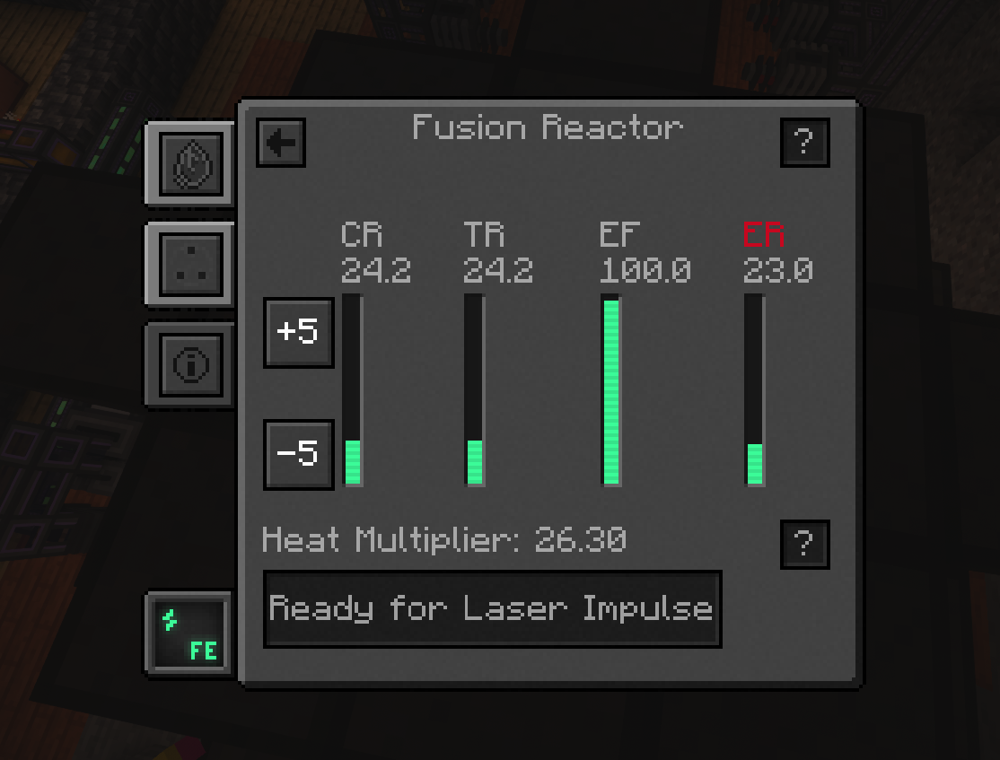

# Pido

A Simple PID Controller for Mekanism Better Fission Reactor

---




## Requirements

- CC:Tweaked (or similar lua environment for minecraft)
- Better Fission Reactor For Mekanism

---

## Usage

- Copy the `pido.lua` file to your minecraft computer using the `wget` command

```shell
wget https://raw.githubusercontent.com/TxMat/pido/main/pido.lua pido.lua
```

- Run the program

```shell
./pido.lua
```


---
## Configuration

Pido is configured to avoid overshoots and prefers to be slow and steady. You can change the comportment of the pid by adjusting the following variables:

- `kp` : Proportional gain
- `ki` : Integral gain
- `kd` : Derivative gain
- `deadband` : Deadband for the error

---
## Disclaimer

This program as is, is not meant to be used with very high injection rates as the Error Level will not have the time to recover. However, if you still want to try it, you can adjust the above variables to your liking. *(and post a PR if you manage to get it working)*


*PRs are welcome btw*

---
*Credits: [TxMat](https://github.com/TxMat)*
